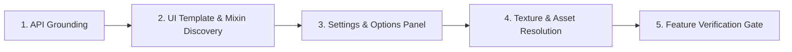

# WoW Addon Feature Development Skill

This skill guides an agent through implementing new features, frames, widgets, settings panels, and API integrations for World of Warcraft addons using the **wow** MCP server.

---

## 1. When to Use This Skill

Activate this skill whenever the task involves:
- Adding new user-facing functionality or gameplay logic to an addon.
- Building in-game UI components (frames, dialogs, buttons, list views, or status bars).
- Creating or updating configuration panels using the modern Settings API.
- Finding and referencing game assets (icons, texture atlases, FileDataIDs).
- Writing cross-client compatibility logic across Retail (Mainline), Classic, and Classic Era.

---

## 2. Feature Development Workflow

Follow this 5-step workflow to implement addon features cleanly and without hallucination:



---

### Step 1: In-Game API Grounding

Blizzard continuously refactors and namespaces in-game Lua APIs (notably across 10.0 Dragonflight and 11.0 The War Within). **Never write WoW API calls from memory.**

1. **Verify Signatures & Namespaces:**
   Call `wow_api_search` before calling any function:
   ```json
   { "query": "C_Container.GetContainerItemInfo", "flavor": "mainline" }
   ```
   * Pay special attention to return types: many APIs now return a single structured table (e.g., `ContainerItemInfo`) rather than multiple legacy scalar returns.
   * Check parameter nilability and field names in `wow_api_type_search`.

2. **Verify Event Payloads:**
   When listening for events to trigger the feature, check argument ordering with `wow_api_event_search`:
   ```json
   { "query": "PLAYER_INTERACTION_MANAGER_FRAME_SHOW", "flavor": "mainline" }
   ```

3. **Verify Enums and Constants:**
   Call `wow_api_type_search` for `Enum.*` and `Constants.*` tables:
   ```json
   { "query": "ItemQuality" }
   ```

---

### Step 2: Blizzard-First UI Discovery

Blizzard's stock UI provides hundreds of battle-tested, localized XML templates and Lua mixins. Reusing them ensures consistent aesthetics and reduces custom code.

1. **Locate Virtual Templates:**
   Call `wow_ui_template_search` to find existing components:
   ```json
   { "query": "UIPanelButtonTemplate", "type": "Button" }
   ```
   Inspect the `chain` field to identify inherited properties and sub-elements.

2. **Find Reusable Mixins:**
   Call `wow_ui_mixin_search` to find behavior mixins:
   ```json
   { "query": "ScrollBox" }
   ```

3. **Inspect Real Shipped FrameXML Implementations:**
   Use `wow_ui_grep` and `wow_ui_read_file` to inspect how Blizzard structures similar features:
   ```json
   { "pattern": "ScrollUtil\\.InitDefaultScrollBoxListWithBar", "fileType": "lua" }
   ```
   Read the file context:
   ```json
   { "path": "Interface/AddOns/Blizzard_SharedXML/Shared/Scroll/ScrollUtil.lua", "startLine": 50, "lineCount": 40 }
   ```

---

### Step 3: Modern Settings & Options Panels

Retail (10.0+) replaced the legacy `InterfaceOptions_AddCategory` with the modern `Settings` API. Always check which pattern is appropriate for the target client.

#### Modern Retail (10.0+ / 11.0+):
```lua
local category, layout = Settings.RegisterVerticalLayoutCategory("MyAddon")
Settings.RegisterAddOnCategory(category)

local function GetSettingValue() return MyAddonDB.enabled end
local function SetSettingValue(val) MyAddonDB.enabled = val end

local setting = Settings.RegisterAddOnSetting(category, "myaddon_enabled", "enabled", MyAddonDB, type(true), "Enable Feature", true)
Settings.CreateCheckbox(category, setting, "Check this to enable the feature.")
```

#### Classic / Legacy Fallback:
If targeting Classic Era or supporting older clients, check availability with `wow_api_search`:
```lua
if Settings and Settings.RegisterAddOnCategory then
    -- Modern Settings API
else
    -- Legacy InterfaceOptionsFrameAddOns
    local panel = CreateFrame("Frame", "MyAddonSettingsPanel", UIParent)
    panel.name = "MyAddon"
    InterfaceOptions_AddCategory(panel)
end
```

---

### Step 4: Texture and Asset Resolution

Never guess texture paths or invent hardcoded file strings.

1. **For Vector/Atlas UI Art:**
   Call `wow_atlas_search` to find atlas elements and their dimensions:
   ```json
   { "query": "common-search-magnifyingglass" }
   ```
   In Lua:
   ```lua
   texture:SetAtlas("common-search-magnifyingglass", true) -- true preserves aspect ratio
   ```

2. **For Icons and Textures:**
   Call `wow_icon_search` to get the numeric `FileDataID`:
   ```json
   { "query": "inv_misc_gem_bloodgem_01" }
   ```
   In Lua, use the numeric FileDataID rather than raw paths:
   ```lua
   texture:SetTexture(133850)
   ```

---

### Step 5: Cross-Flavor Compatibility

When supporting multiple client flavors (Retail, Classic progression, Classic Era):

1. **Compare APIs Across Flavors:**
   Call `wow_api_diff` to check availability:
   ```json
   { "name": "GetContainerNumSlots" }
   ```

2. **Use Project IDs for Branching:**
   ```lua
   local isRetail = (WOW_PROJECT_ID == WOW_PROJECT_MAINLINE)
   local isClassic = (WOW_PROJECT_ID == WOW_PROJECT_CLASSIC)
   local isVanilla = (WOW_PROJECT_ID == WOW_PROJECT_WRATH_CLASSIC or WOW_PROJECT_ID == 11) -- Check actual flavor constants

   if isRetail then
       return C_Container.GetContainerNumSlots(bagID)
   else
       return GetContainerNumSlots(bagID)
   end
   ```

---

### Step 6: Feature Verification Gate

Before concluding any feature task, validate all touched files:

1. **Lint Lua Code:**
   Call `wow_lua_lint` with the appropriate flavor:
   ```json
   { "code": "...", "flavor": "mainline" }
   ```
   Ensure 0 errors and 0 unaddressed warnings.

2. **Validate XML Templates:**
   If XML files were added or modified, call `wow_xml_validate`:
   ```json
   { "content": "..." }
   ```
