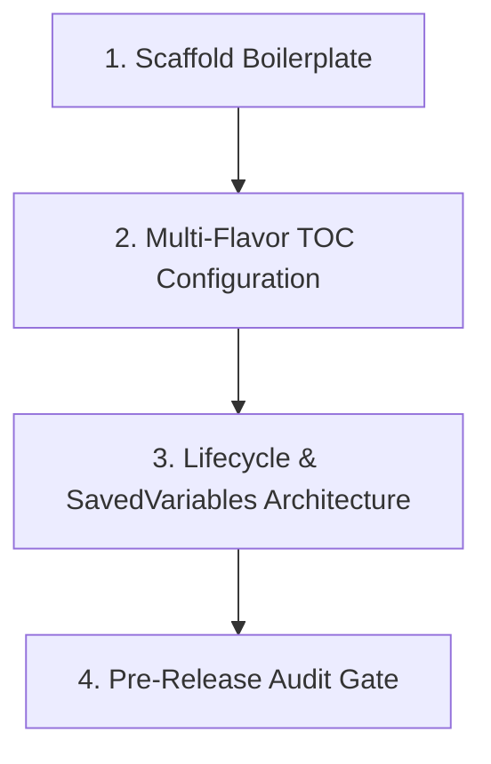

# WoW Addon Scaffolding, Architecture & Audit Skill

This skill guides an agent through creating new World of Warcraft addons from scratch, structuring multi-client manifests, architecting initialization and SavedVariables, and running comprehensive pre-release quality audits using the **wow** MCP server.

---

## 1. When to Use This Skill

Activate this skill whenever:
- Starting a brand-new World of Warcraft addon project.
- Setting up or validating `.toc` manifests across client flavors (Mainline, Classic, Classic Era).
- Establishing addon architecture: namespaces (`addonName, ns`), lifecycle events, and SavedVariables.
- Auditing an existing addon's files (`.toc`, `.xml`, `.lua`) prior to release or publication.

---

## 2. Addon Architecture & Scaffolding Workflow



---

### Step 1: Scaffold Boilerplate

Use `wow_addon_scaffold` to generate a standards-compliant addon structure:

```json
{
  "name": "MyAddon",
  "flavor": "mainline",
  "features": ["options", "events", "xml"]
}
```

This generates a structured addon layout:
```text
MyAddon/
├── MyAddon.toc            # Manifest and load sequence
├── MyAddon_Mainline.toc   # Retail-specific manifest (optional multi-flavor)
├── MyAddon_Vanilla.toc    # Classic Era manifest (optional multi-flavor)
├── Core.lua               # Namespace, event registration, and initialization
├── UI.lua                 # Frame creation and visual elements
├── UI.xml                 # XML templates (if needed)
└── Options.lua            # Settings / configuration panel
```

---

### Step 2: Multi-Flavor TOC Manifest Configuration

World of Warcraft supports flavor-specific `.toc` suffixes to allow one addon codebase to support Retail, Classic progression, and Classic Era simultaneously:

| Flavor | TOC File Suffix | Example Interface Version |
| :--- | :--- | :--- |
| **Retail (The War Within)** | `_Mainline.toc` | `110100` |
| **Classic Progression (Cata/Mists)** | `_Cata.toc` / `_Mists.toc` | `40402` |
| **Classic Era (Vanilla)** | `_Vanilla.toc` | `11506` |

#### Recommended TOC Header Structure:
```toc
## Interface: 110100
## Title: MyAddon
## Notes: A clean, reliable World of Warcraft addon.
## Author: YourName
## Version: 1.0.0
## SavedVariables: MyAddonDB
## SavedVariablesPerCharacter: MyAddonCharDB
## IconTexture: 133850
## DefaultState: enabled

# File Load Sequence (Strictly Top-to-Bottom)
Core.lua
UI.lua
Options.lua
```

#### Validate Manifest with `wow_toc_validate`:
Call `wow_toc_validate` with the manifest content to verify interface version, directives, and file lists:
```json
{ "content": "## Interface: 110100\n## Title: MyAddon\nCore.lua\n" }
```

---

### Step 3: Lifecycle & SavedVariables Architecture

Follow established WoW architecture standards to guarantee clean state initialization:

#### 1. The Private Addon Namespace:
At the top of every `.lua` file, capture the addon name and shared namespace table passed in by the WoW client:
```lua
local addonName, ns = ...
```

#### 2. Event Lifecycle Initialization:
Split initialization into two distinct lifecycle phases:
* `ADDON_LOADED`: Fired when SavedVariables for this addon are loaded from disk into memory. Initialize databases here.
* `PLAYER_LOGIN`: Fired when character and world data are available. Initialize UI frames, secure handlers, and Settings panels here.

```lua
local addonName, ns = ...
local eventFrame = CreateFrame("Frame")
eventFrame:RegisterEvent("ADDON_LOADED")
eventFrame:RegisterEvent("PLAYER_LOGIN")

local defaults = {
    enabled = true,
    scale = 1.0,
    point = { "CENTER", nil, "CENTER", 0, 0 }
}

local function InitSavedVariables()
    MyAddonDB = MyAddonDB or {}
    -- Deep merge defaults to avoid overwriting user values
    for key, value in pairs(defaults) do
        if MyAddonDB[key] == nil then
            MyAddonDB[key] = value
        end
    end
end

eventFrame:SetScript("OnEvent", function(self, event, arg1)
    if event == "ADDON_LOADED" and arg1 == addonName then
        InitSavedVariables()
    elseif event == "PLAYER_LOGIN" then
        ns.CreateAddonUI()
        ns.RegisterSettings()
    end
end)
```

---

### Step 4: Pre-Release Quality Audit Gate

Before publishing or concluding work on an addon, run all three validation tools:

1. **Audit TOC Files:**
   Call `wow_toc_validate` on all `.toc` files to ensure proper interface numbers and valid file extensions.
2. **Audit XML Schemas:**
   Call `wow_xml_validate` on all `.xml` files to verify tag structure, element hierarchy, and attribute types against Blizzard's `UI.xsd`.
3. **Audit Lua Code:**
   Call `wow_lua_lint` across all `.lua` files for each supported client flavor:
   ```json
   { "code": "<file content>", "flavor": "mainline" }
   ```
   Ensure zero errors, zero moved-namespace warnings, and zero taint hazards.
