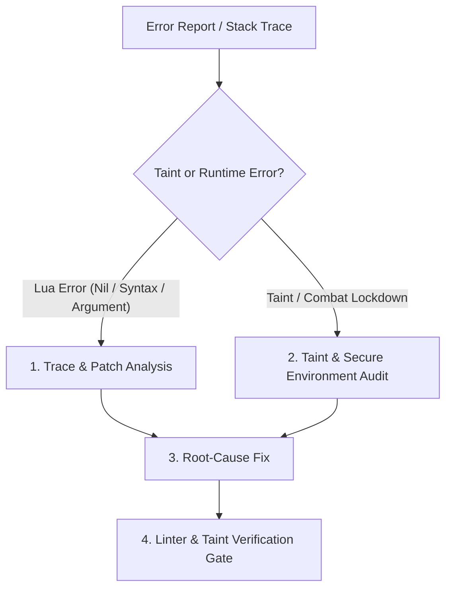

# WoW Addon Troubleshooting & Taint Diagnosis Skill

This skill guides an agent through diagnosing, isolating, and fixing World of Warcraft addon bugs, runtime exceptions, execution taint, and combat lockdown errors using the **wow** MCP server.

---

## 1. When to Use This Skill

Activate this skill whenever:
- The user reports a Lua error, stack trace, or addon crash.
- The game throws `"Interface action failed because of an AddOn"` (execution taint).
- Protected actions or frame modifications fail during combat (`InCombatLockdown()`).
- An addon broke after a game patch or expansion release (e.g., functions moved into `C_*` namespaces or return types changed).
- An action bar, unit frame, or raid frame becomes unresponsive in combat.

---

## 2. Troubleshooting Methodology



---

### Phase 1: Diagnosing Lua Runtime Errors

When presented with a Lua error or stack trace:

#### 1. Analyze the Error Message Pattern:
* **`attempt to call global '...' (a nil value)`**:
  - The function was likely moved into a `C_*` namespace or removed in a recent client patch.
  - Run `wow_api_search` to find the modern replacement:
    ```json
    { "query": "GetContainerNumSlots", "flavor": "mainline" }
    ```
  - Or run `wow_lua_lint` directly on the offending file/snippet to receive automatic replacement advice.

* **`attempt to index field '...' (a nil value)`**:
  - Many modern APIs return a single structured table object instead of multiple unpacked values (e.g., `C_Item.GetItemInfo`, `C_UnitAuras.GetAuraDataByIndex`).
  - Check the return structure using `wow_api_search` and `wow_api_type_search`:
    ```json
    { "query": "C_UnitAuras.GetAuraDataByIndex", "flavor": "mainline" }
    ```

* **`script ran too long`**:
  - Indicates an infinite loop, recursive event trigger, or massive unthrottled iteration inside an `OnUpdate` or event handler. Throttle `OnUpdate` using an elapsed timer accumulation pattern.

---

### Phase 2: Execution Taint & Combat Lockdown

Taint occurs when third-party addon code interacts with secure Blizzard execution paths, preventing protected actions from executing.

#### 1. Understand the Taint Rules:
* **Execution Taint:** Once non-Blizzard code executes, the execution path is marked as tainted. Calling any protected function from this path causes an immediate failure.
* **Variable Taint:** Assigning a tainted value to a global table or secure frame property taints that variable. If Blizzard's secure UI later reads that variable, execution becomes tainted.

#### 2. Common Causes of "Interface action failed":
1. **Directly Calling Protected Functions:**
   Functions like `CastSpellByName`, `TargetUnit`, `AttackTarget`, `ClearOverrideBindings`, `UseAction`, and `SetBinding` cannot be called from generic addon Lua.
   * **Fix:** Use secure buttons inheriting `SecureActionButtonTemplate` and set attributes outside of combat (`type`, `spell`, `unit`).

2. **Hooking Global Blizzard Functions Incorrectly:**
   Never overwrite or wrap Blizzard functions directly:
   ```lua
   -- DANGEROUS / CAUSES TAINT:
   local orig = Frame_OnShow
   Frame_OnShow = function(...) orig(...); MyCode() end
   ```
   * **Fix:** Always use `hooksecurefunc`:
     ```lua
     hooksecurefunc("Frame_OnShow", function(...) MyCode() end)
     hooksecurefunc(BlizzardFrame, "SetPoint", function(...) MyCode() end)
     ```

3. **Modifying Secure Frames During Combat:**
   Calling `Show()`, `Hide()`, `SetPoint()`, `ClearAllPoints()`, or `SetParent()` on secure frames (action bars, unit frames, raid frames) while in combat triggers an error.
   * **Fix:** Check `InCombatLockdown()` and defer updates until `PLAYER_REGEN_ENABLED`:
     ```lua
     local pendingUpdate = false

     local function SafeUpdateFrame()
         if InCombatLockdown() then
             pendingUpdate = true
             return
         end
         -- Perform frame manipulation safely
         MyFrame:SetPoint("CENTER", UIParent, "CENTER", 0, 0)
         pendingUpdate = false
     end

     -- Listen for combat exit
     local eventFrame = CreateFrame("Frame")
     eventFrame:RegisterEvent("PLAYER_REGEN_ENABLED")
     eventFrame:SetScript("OnEvent", function(self, event)
         if event == "PLAYER_REGEN_ENABLED" and pendingUpdate then
             SafeUpdateFrame()
         end
     end)
     ```

4. **Global Variable Leakage:**
   Accidentally assigning variables without `local` can overwrite stock Blizzard globals.
   * **Fix:** Always scope variables locally, or store addon data in `local addonName, ns = ...`.

---

### Phase 3: Retail (11.0+) Secret Arguments & Restrictions

Retail 11.0 (The War Within) introduced secret arguments and restricted access to certain unit and encounter data during combat:
* APIs with `secretArguments` cannot have their values inspected, formatted, or passed to external logic.
* Check whether a target API has restricted flags using `wow_api_search`:
  ```json
  { "query": "UnitPosition", "flavor": "mainline" }
  ```
  Look for `AllowedWhenUntainted` and `secretArguments` fields.

---

### Phase 4: Troubleshooting Verification Gate

After applying fixes:
1. **Run `wow_lua_lint` on all affected files:**
   ```json
   { "code": "<patched Lua code>", "flavor": "mainline" }
   ```
   Ensure the linter reports 0 taint warnings, 0 removed API warnings, and 0 unknown events.
2. **Verify Cross-Flavor Safety:**
   If the addon runs on Classic as well, re-lint with `"flavor": "vanilla"` to ensure the fix didn't break older client compatibility.
